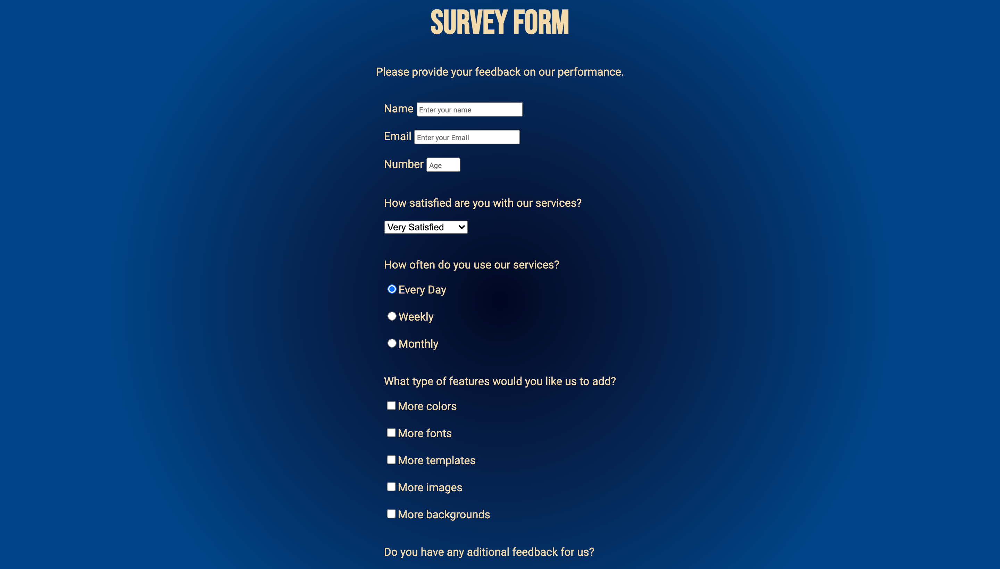

# Trials Project Review

> This is one of my three Trials projects that I am uploading so I can perform a self-code review as part of an exercise during my Microverse career

The project is a Survey Form for a fictional company

## Built With

- HTML and CSS

## Authors

👤 **Santiago Velosa**

- GitHub: [@vechicin](https://github.com/vechicin)
- Twitter: [@vechicin](https://twitter.com/vechicin)
- LinkedIn: [Santiago Velosa Arias](https://www.linkedin.com/in/santiago-velosa-arias-5b7543112/)

## 🤝 Contributing

Contributions, issues, and feature requests are welcome!

Feel free to check the [issues page](https://github.com/vechicin/Hello-Microverse/issues).

## Show your support

Give a ⭐️ if you like this project!

## Acknowledgments

- Hat tip to anyone whose code was used
- Inspiration
- etc

## 📝 License

This project is [MIT](./MIT.md) licensed.
